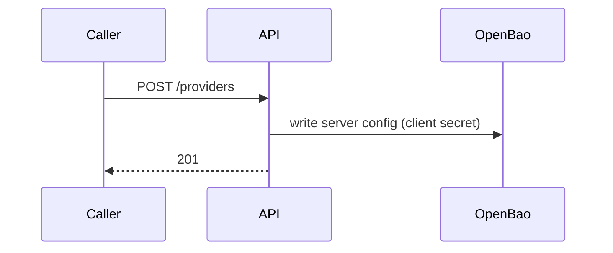
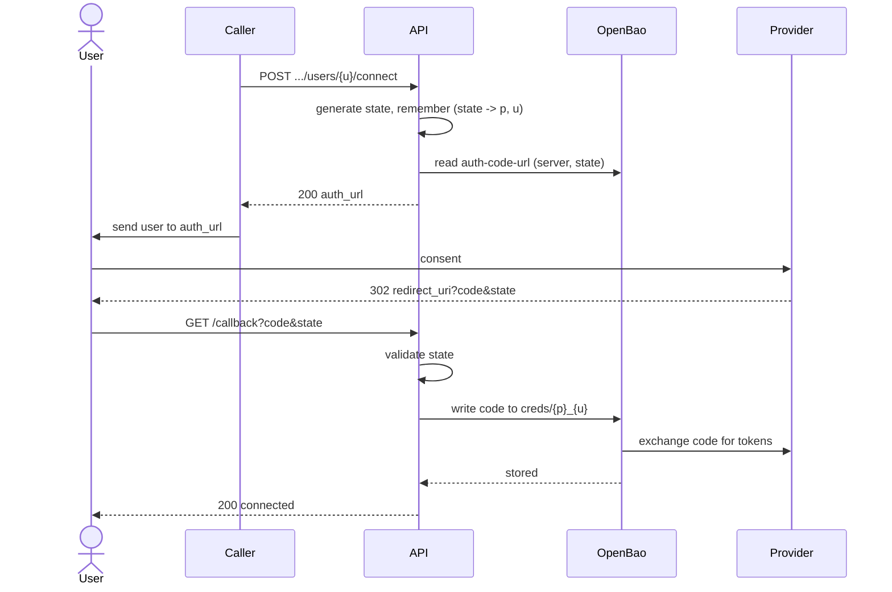
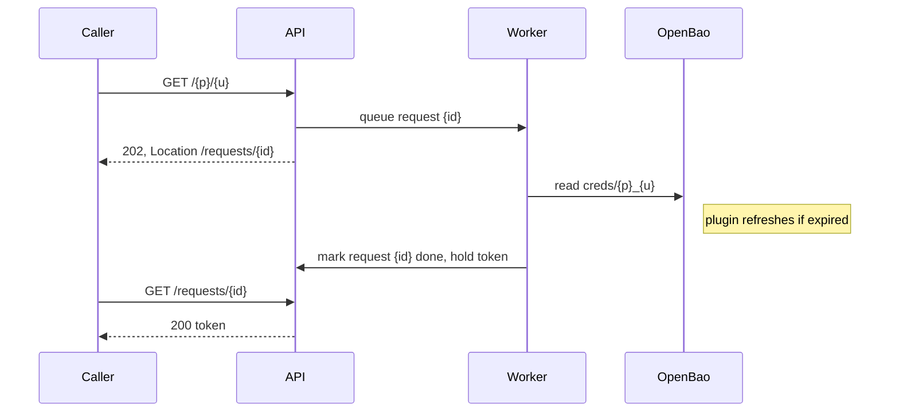

# Take-Home Problem: Integration Aggregator

**Role:** Junior Software Engineer
**Expected effort:** 2–3 days of focused work, completed within one week.
**Language:** Go or Python (pick one, use it idiomatically).
**Cost:** Everything runs locally or on free tiers. No paid services are
required or accepted.
**Workflow:** Fork this repository and build in your public fork. There is no
submission step. Your fork's default branch, with a green CI run on the final
commit, is the deliverable. Open a pull request against this repository only
to fix an error in the problem statement itself.

## Background

Product teams keep re-implementing OAuth for the same public providers (Google,
GitHub). We want one internal service that owns provider registration, the
OAuth authorization-code flow, and token storage, so other services can ask it
for a user's access token instead of handling OAuth themselves.

Tokens are secrets. They must live in a secrets manager, never in application
state, files, or logs. You will use [OpenBao](https://openbao.org) with the
[openbao-plugin-secrets-oauthapp](https://github.com/openbao/openbao-plugin-secrets-oauthapp)
plugin, which implements the authorization-code exchange, stores tokens, and
refreshes them before expiry. Your service orchestrates the flow and exposes a
clean API. It does not implement OAuth itself and it never persists a token
outside OpenBao.

## Getting set up

Budget half a day for environment setup before writing any code. These are
the docs we used. They contain everything you need; the wiring between them
is the exercise.

Work in this order and do not skip ahead:

1. Cluster up, OpenBao running with the plugin enabled, service deployed by
   `make up`.
2. The three flows working locally, driven by curl.
3. Only then: CI, publishing, and the perf test.

Steps 1 and 2 are most of the value and most of the difficulty. CI and perf
testing automate what already works. Starting there wastes your week.

**Local cluster**

- [minikube](https://minikube.sigs.k8s.io/docs/start/) — install and start a
  local cluster. Pick a driver that works on your OS from the same docs.
- [kubectl](https://kubernetes.io/docs/tasks/tools/) — cluster CLI.
- [Helm](https://helm.sh/docs/intro/install/) — installs OpenBao and deploys
  your chart. [Chart authoring guide](https://helm.sh/docs/chart_template_guide/)
  and [OCI registries](https://helm.sh/docs/topics/registries/) for publishing.

**OpenBao and the plugin**

- [OpenBao docs](https://openbao.org/docs/) — start with dev-mode server and
  the concepts section on auth and policies.
- [openbao-helm](https://github.com/openbao/openbao-helm) — the chart for
  running OpenBao in the cluster.
- [Plugin management](https://openbao.org/docs/plugins/plugin-management/) —
  how external plugins are registered and enabled. You will need this for the
  next item.
- [openbao-plugin-secrets-oauthapp](https://github.com/openbao/openbao-plugin-secrets-oauthapp)
  — read the whole README before designing your API. Prebuilt binaries are on
  the releases page.

**OAuth providers**

- [OAuth 2.0 overview](https://oauth.net/2/) — the authorization-code flow,
  if it is new to you.
- [Creating a GitHub OAuth app](https://docs.github.com/en/apps/oauth-apps/building-oauth-apps/creating-an-oauth-app)
- [Google OAuth 2.0](https://developers.google.com/identity/protocols/oauth2/web-server)
- [Dex](https://dexidp.io/docs/) or
  [mock-oauth2-server](https://github.com/navikt/mock-oauth2-server) — the
  local provider for your CI smoke test.

**CI and load testing** (last, after the local flow works)

- [GitHub Actions](https://docs.github.com/en/actions) and
  [setup-minikube](https://github.com/medyagh/setup-minikube) — minikube on a
  free runner.
- [ghcr.io container registry](https://docs.github.com/en/packages/working-with-a-github-packages-registry/working-with-the-container-registry)
  — image and chart publishing with the built-in `GITHUB_TOKEN`.
- [k6](https://grafana.com/docs/k6/latest/),
  [hey](https://github.com/rakyll/hey), or
  [Locust](https://docs.locust.io/) — pick one for the perf test.

## What to build

A single HTTP service, deployed to a local minikube cluster, with OpenBao as
its only backing store. There is no database. Provider metadata, connection
state, and async request state are held in memory by the service.

### Required flow

1. **Register a provider.** An operator registers an OAuth provider
   (GitHub and at least one of Google/GitLab) with its client ID and client
   secret. Your service configures the corresponding server entry in the
   oauthapp secrets engine. Client secrets go to OpenBao only.
2. **Connect a user.** A caller starts a connection for
   `(provider, user_id)`. Your service returns the provider's authorization
   URL (the plugin generates it). The user completes consent in a browser.
   Your callback endpoint receives the OIDC authorization code and hands it to
   the plugin, which exchanges it for tokens and stores them.
3. **Retrieve a token.** A caller requests the current access token for
   `(provider, user_id)`. The plugin refreshes expired tokens transparently.

Both GitHub OAuth apps and Google OAuth clients are free to create. Use
`http://localhost:<port>/callback` (via `kubectl port-forward` or
`minikube service`) as the redirect URI.

### API

Exact paths are yours to design, but it must include the equivalents of:

| Endpoint | Behavior |
|---|---|
| `POST /providers` | Register a provider (name, client ID, client secret). |
| `POST /providers/{provider}/users/{user}/connect` | Start a connection. Returns the authorization URL and a state value. |
| `GET /callback` | Receives `code` and `state`, completes the exchange via the plugin. |
| `GET /{provider}/{user}` | Returns the user's current access token. |
| `GET /requests/{id}` | Status/result of an async request (see below). |

### Async requirement

`GET /{provider}/{user}` must not block on OpenBao inline. It returns
`202 Accepted` with a request ID and a `Location` header. A background worker
(goroutine or async task inside the same process) fulfills the request, and
the caller polls `GET /requests/{id}` for the result. Request state is an
in-memory structure. A single replica is acceptable. State in `DESIGN.md` what
breaks at more than one replica and what you would use to fix it.

### Data placement

- **OpenBao:** client secrets and all OAuth tokens.
- **Service memory:** provider names, connection state (OAuth `state` values),
  async request status. Nothing here is ever written to disk.

A token or client secret found in a log, an HTTP response other than the
token endpoint, or the repo is a failing condition.

### Sequence

The reference flow. Your paths may differ, the ordering and data placement
may not.

**Register a provider**

**Connect a user**

**Retrieve a token (async)**

Token freshness, refresh, and caching are the plugin's job. Do not build your
own cache or refresh logic.

## Delivery requirements

1. **Makefile, idempotent.** `make up` from a clean machine (minikube
   installed, cluster may or may not exist) brings up minikube, OpenBao with
   the oauthapp plugin registered and enabled, and your service. Running
   `make up` twice in a row succeeds and changes nothing the second time.
   `make down` tears it all down.
2. **No secrets in the repo.** `.gitignore` covers env files, unseal keys,
   root tokens, client secrets. Secrets enter the cluster at deploy time
   (e.g. Kubernetes Secrets created by `make up` from local env files).
3. **Performance test.** A script (k6, hey, locust, or similar) that load-tests
   the token-retrieval path, plus a short report in the repo: p50/p95 latency
   and throughput at two or three concurrency levels.
4. **Published artifacts.** A container image and a Helm chart, both published
   from CI to ghcr.io under your fork (the default `GITHUB_TOKEN` can push
   both via OCI). `make up` deploys from the chart, not from raw manifests.
5. **CI proves it works.** A GitHub Actions workflow in your fork that, on
   every push: runs unit tests, runs `make up` on minikube (works on
   `ubuntu-latest`, free for public repos), executes an end-to-end smoke test
   of the full flow, runs the perf script, and uploads the perf report as a
   build artifact. Interactive consent cannot run in CI, so the smoke test
   must use a local OIDC provider that can be driven programmatically (Dex
   with static passwords, or navikt/mock-oauth2-server) registered through
   the same `POST /providers` path as a real provider. We evaluate by reading
   your CI run, not by running your code.

### Kubernetes or Terraform depth

The base path is Kubernetes: a Helm chart you wrote (not just `helm create`
output), with values for image, OpenBao address, replica count,
resource limits, and probes.

Alternative for the OpenBao setup: instead of scripting `bao` CLI calls in the
Makefile, manage the plugin mount, server config, and policies with Terraform
and the OpenBao provider. Either path is acceptable. Doing the OpenBao
configuration in Terraform on top of the Helm-based deploy counts as a plus.

## What we evaluate

| Area | Weight | What we look for |
|---|---|---|
| Working flow | 40% | Green CI on the final commit: fresh `make up`, then registration, consent (local OIDC), code exchange, and token retrieval end to end. Red or absent CI caps this area at zero. |
| Kubernetes/Terraform | 25% | Chart quality, idempotent deploy, sane probes and resources, or equivalent Terraform rigor. |
| Code quality | 20% | Small focused files, clear package/module boundaries, error handling, tests. Files over ~300 lines need a reason. |
| Security hygiene | 10% | Nothing sensitive in the repo or logs. Least-privilege OpenBao policy for the service is a plus. |
| Async + performance | 5% | 202 flow is correct (no lost requests, no duplicate fulfillment), perf report is present and honest. |

## How we review your fork

We spend about 20 minutes per fork, in this order. Make each step easy.

1. CI status on the final commit of the default branch. Red stops the review.
2. The CI run itself: smoke-test output and the perf-report artifact.
3. `DESIGN.md` (one page, required): architecture, what lives where and why,
   and what you would change for production.
4. A code skim guided by the rubric above.

Your fork must contain all code, the Makefile, the chart and workflow sources,
and the perf script. A terminal transcript or short recording of the flow
against real GitHub, committed to the repo, covers the part CI cannot: proof
the real-provider consent path works. Include one.

## Hints

- Read the oauthapp plugin README first. It already does the hard parts:
  `config/auth-code-url` builds the authorization URL, writing the code to
  `creds/<name>` performs the exchange, reading `creds/<name>` returns a
  fresh access token.
- OpenBao dev mode is fine for this exercise. Note in `DESIGN.md` what dev
  mode skips (persistence, unsealing, TLS).
- The plugin binary must be present in the OpenBao pod and registered in the
  plugin catalog. Getting this scripted idempotently is part of the exercise.
- CI already requires a local OIDC provider. If Google's console blocks you
  (e.g. verification prompts), that local provider counts as your second
  provider alongside GitHub. Say so in `DESIGN.md`.
- Your fork is public. Real client secrets stay in your local env files and
  repository Action secrets, never in a commit.
